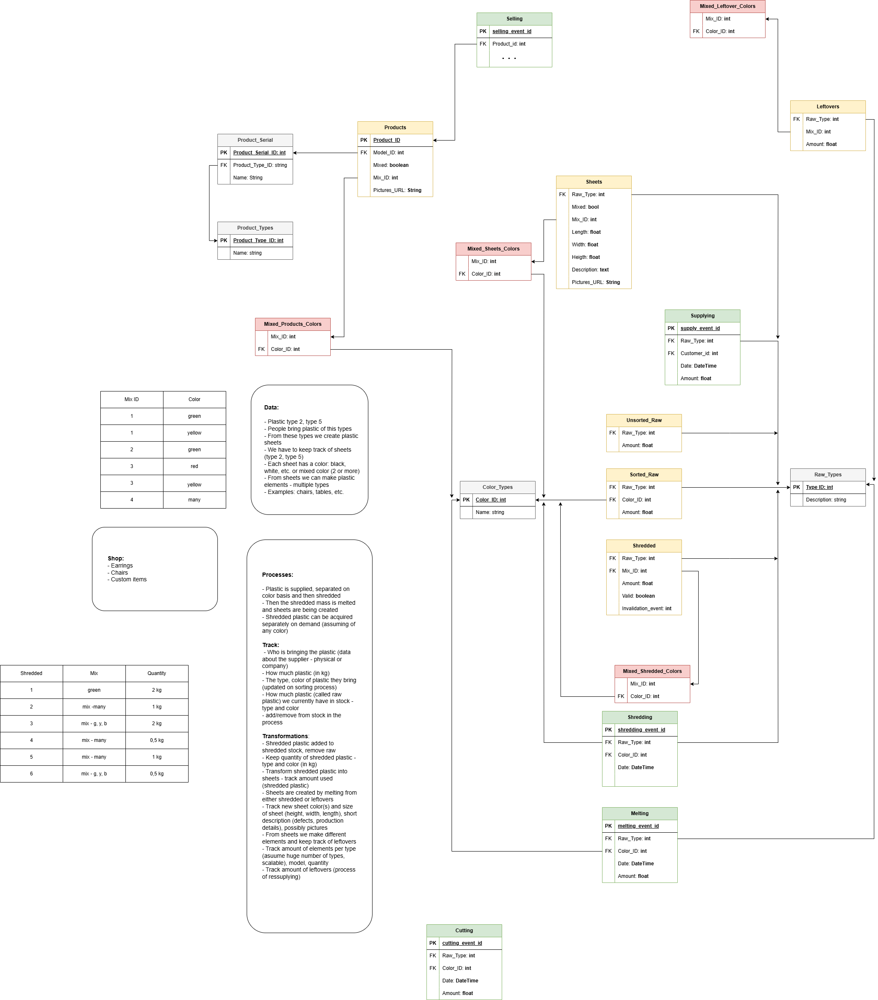

# Plastic ERP (Enterprise Resource Planning) Application

Enterprise resource planning (ERP) application's backend:
- Django 
- DB ORM models
- RESTful API (using Ninga API)

## Steps to build the project

1. Make sure to open inside Dev Container either by Running it from the VS Code's Command Pallette or by accessing the following URL:

[
    
](
    https://vscode.dev/redirect?url=vscode://ms-vscode-remote.remote-containers/cloneInVolume?url=https://github.com/provornydan/plastic_erp
)


2. Run the following command with Bash Terminal inside 'plastic-django':
```bash
$ uv sync

$ ./manage.py runserver
```

3. ORM definitions will approximately replicate the following Entity Relationship Diagram:


